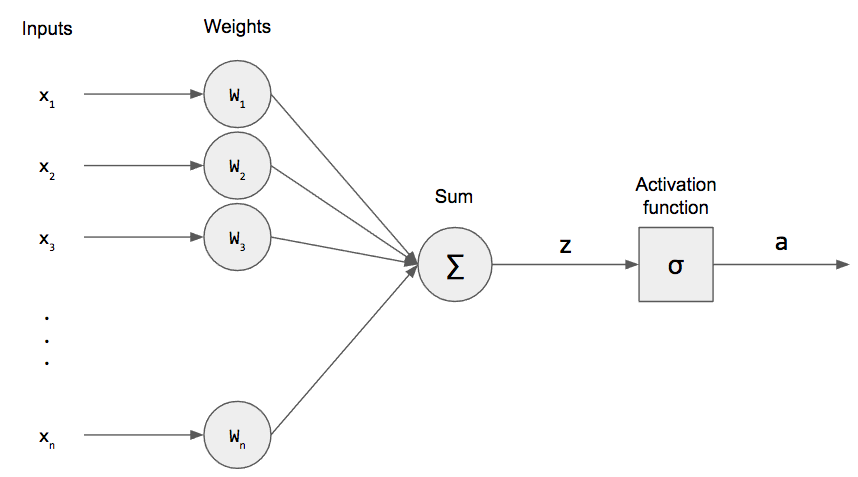

# Deep-Learning
 
This File contain all the concepts related to deep learning and still in progress........
All the data set on which I have worked in also included in this repo....or you can download it from kaggle.

 

<h3>Prerequisites</h3>
<h4>Before running the project, ensure you have the following dependencies installed:</h4>
<ul>
 <li>Python 3.x</li>
 <li>TensorFlow</li>
 <li>Keras</li>
 <li>NumPy</li>
 <li>Matplotlib</li>
</ul>
 

<h3><b>Basic Defination of Deep Learning:</b></h3>
Deep learning is a part of a broader family of machine learning methods based on artificial neural networks with representation learning.It uses multiple layers to progressively extract higher level feature from the raw input 
ex:In impage processing lower layers may identify the concepts relevant to human suchs as digit or letters or face

<ul>
  <h3><b>PERCEPTRON</b></h3>
  
  <li style="float">Perceptron is an alogorithm of an supervised learning algorithm which is designed in such a way that it become the basic building block of the Deep learning or you can that it is an mathematical model</li>
 <h4>Perceptron Tricks</h4>
  
Coeff_new = Coeff_old - n*Coordinate          where n-learning rate
  <h4>Problem With Perceptron Trick:</h4> 
   The Value of w1,w2,b will be given bt this trick are not very sure that it will give 100 percent the best line to classify 
   (i)Quantify Result:It Can't tell that result will not able to tell the classification. 
   (ii)Do not Converge
  

 
